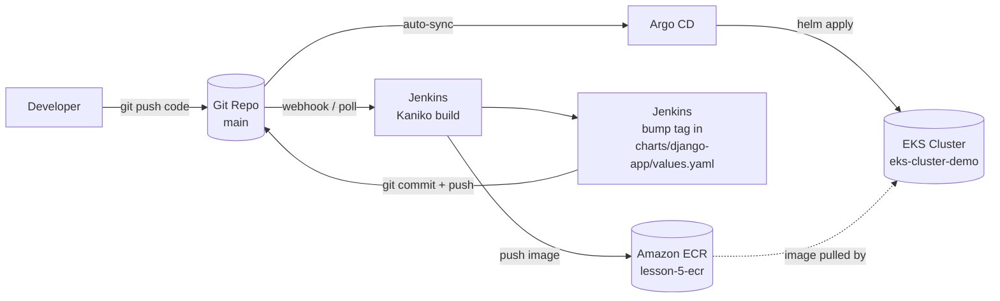

# GoIT DevOps — Lesson 8-9: CI/CD with Jenkins, Kaniko, ECR & Argo CD (GitOps)

End-to-end CI/CD pipeline for a Django application on AWS EKS. The whole platform
(networking, container registry, cluster, Jenkins and Argo CD) is provisioned with
Terraform. Delivery is fully automated and GitOps-driven: Jenkins builds the image and
bumps the chart tag in Git, then Argo CD reconciles the desired state onto the cluster.

## 1. Overview

The pipeline wires together build, publish and deploy into one continuous flow:

1. A **developer** pushes application code to the Git repository.
2. **Jenkins** (running as pods on EKS) schedules a Kubernetes pod agent and uses
   **Kaniko** to build the Django image from `django/Dockerfile` — no Docker daemon needed.
3. Kaniko pushes the image to **Amazon ECR** (`lesson-5-ecr`), authenticating through the
   `jenkins-sa` service account, which is bound to an IRSA role with ECR push permissions.
4. Jenkins then clones the repo and **bumps the image tag** in
   `charts/django-app/values.yaml` (via `sed`), commits and pushes back to `main`.
5. **Argo CD** watches the repo, detects the changed tag, and **auto-syncs** the Helm
   chart to the EKS cluster — no manual `kubectl apply` or `helm upgrade`.

Git is the single source of truth. The cluster state always converges to what is committed
in `charts/django-app` — this is the GitOps model.

## 2. Architecture / CI/CD Flow



ASCII fallback:

```
Developer --push code--> Git(main) --> Jenkins(Kaniko build) --> ECR
                          ^                     |
                          |                     v
                          +-- git tag bump <-- Jenkins(update values.yaml)
                          |
                          +--> Argo CD --(auto-sync helm)--> EKS <--pull image-- ECR
```

## 3. Prerequisites

| Tool / account | Purpose |
| --- | --- |
| **Terraform** `>= 1.0` | Provision all infrastructure |
| **AWS CLI** | Authenticate, bootstrap backend, update kubeconfig |
| **kubectl** | Inspect the cluster, read secrets |
| **helm** `>= 3` | Chart tooling (providers also invoke Helm) |
| **AWS account** | Region `eu-north-1`; permissions for VPC, EKS, ECR, IAM, S3, DynamoDB |
| **GitHub PAT** | `repo` scope — used by Jenkins (`github-token`) and Argo CD to push/read Git |

## 4. Terraform Layout

Configuration lives at the repository root: `main.tf` (providers + module wiring),
`backend.tf` (S3 remote state), `outputs.tf`, and the reusable modules below.

| Module | Path | Responsibility |
| --- | --- | --- |
| **s3-backend** | `modules/s3-backend` | S3 state bucket `terraform-state-mkryvenko-21062026` + DynamoDB lock table `terraform-locks` |
| **vpc** | `modules/vpc` | VPC `10.0.0.0/16`, 3 public + 3 private subnets across 3 AZs, IGW, NAT, routing |
| **ecr** | `modules/ecr` | ECR repository `lesson-5-ecr` with scan-on-push enabled |
| **eks** | `modules/eks` | EKS cluster `eks-cluster-demo`, managed node group (`t3.small`, 1-3 nodes), OIDC provider, EBS CSI driver + default `gp3` storage class |
| **jenkins** | `modules/jenkins` | Jenkins via Helm; `jenkins-sa` service account with IRSA role granting ECR push (Kaniko) |
| **argo_cd** | `modules/argo_cd` | Argo CD via Helm + an app-of-apps chart declaring the `django-app` Application (repo, path `charts/django-app`, revision `main`) with auto-sync |
| **rds** | `modules/rds` | Flexible database module — Aurora cluster **or** standard RDS instance via `use_aurora`; always creates subnet group, security group, and parameter group (see [§11](#11-rds-database-module)) |
| **monitoring** | `modules/monitoring` | `monitoring` namespace + Prometheus (`prometheus-community/prometheus`) and Grafana (`grafana/grafana`) via Helm; Grafana pre-provisioned with a Prometheus datasource and ready dashboards (see [§8](#8-monitoring-prometheus--grafana)) |

The `helm` and `kubernetes` providers in `main.tf` authenticate to the cluster using
`module.eks` outputs (endpoint, CA cert, auth token) — which is why the cluster must exist
before those providers can initialize (see the two-phase apply below).

Application chart: `charts/django-app` (Deployment, LoadBalancer Service, HPA 2-6 @ 70% CPU,
ConfigMap, Secret, in-cluster Postgres). Pipeline: root `Jenkinsfile`.

## 5. Deployment

### 5.1 Backend bootstrap (one-time)

`backend.tf` stores state in S3 with DynamoDB locking. The bucket and table must exist
**before** `terraform init` can use the remote backend. The `s3-backend` module also declares
them for management, so use a two-step bootstrap on a fresh account.

```bash
# Create the state bucket + lock table first (local state), then adopt the backend.
aws s3api create-bucket \
  --bucket terraform-state-mkryvenko-21062026 \
  --region eu-north-1 \
  --create-bucket-configuration LocationConstraint=eu-north-1

aws dynamodb create-table \
  --table-name terraform-locks \
  --attribute-definitions AttributeName=LockID,AttributeType=S \
  --key-schema AttributeName=LockID,KeyType=HASH \
  --billing-mode PAY_PER_REQUEST \
  --region eu-north-1
```

> If the bucket and table already exist (from an earlier lesson), skip this step.

### 5.2 Initialize

```bash
terraform init
```

### 5.3 Two-phase apply

The `helm` and `kubernetes` providers need a live cluster to authenticate against. On a fresh
apply that cluster does not yet exist, so apply the EKS module first, then everything else.

```bash
# Phase 1 — create the cluster (and its dependencies) first
terraform apply -target=module.eks

# Phase 2 — full apply: Jenkins + Argo CD (helm/kubernetes providers now have a cluster)
terraform apply
```

### 5.4 Configure kubectl

```bash
aws eks update-kubeconfig --name eks-cluster-demo --region eu-north-1
kubectl get nodes
```

## 6. Jenkins Setup

1. Get the Jenkins LoadBalancer URL:
   ```bash
   kubectl -n jenkins get svc
   ```
   Open the `EXTERNAL-IP`/hostname of the Jenkins service in a browser.
2. Log in with **`admin` / `admin123`**.
3. Add a credential of type **Username with password**:
   - **ID:** `github-token`
   - **Username:** your GitHub username
   - **Password:** your GitHub PAT (`repo` scope)

   The `Jenkinsfile` references this exact ID (`credentialsId: 'github-token'`) to clone and
   push the tag-bump commit.
4. Create a **Pipeline** job that reads the pipeline from SCM, pointing at the root
   `Jenkinsfile` in this repository (branch `main`).
5. Before the first run, set `ECR_REGISTRY` in the `Jenkinsfile` (or a Jenkins global env) —
   replace `<ACCOUNT_ID>` with your 12-digit AWS account id, e.g.
   `495403531175.dkr.ecr.eu-north-1.amazonaws.com`.

Each build then: Kaniko builds `django/Dockerfile` and pushes
`lesson-5-ecr:v1.0.<BUILD_NUMBER>` to ECR, then bumps `tag:` in
`charts/django-app/values.yaml` and pushes to `main`.

## 7. Argo CD

1. Get the Argo CD LoadBalancer URL:
   ```bash
   kubectl -n argocd get svc argo-cd-argocd-server
   ```
   Open the `EXTERNAL-IP`/hostname in a browser.
2. Retrieve the initial admin password (username is `admin`):
   ```bash
   kubectl -n argocd get secret argocd-initial-admin-secret \
     -o jsonpath='{.data.password}' | base64 -d
   ```
3. **Auto-sync:** the `argo_cd` module deploys an app-of-apps chart that declares a
   `django-app` Application tracking `charts/django-app` on branch `main`. Its `syncPolicy`
   is automated, so when Jenkins pushes the new image tag, Argo CD detects the drift and
   applies the updated Helm chart to the cluster automatically — no manual sync needed.

## 8. Monitoring (Prometheus + Grafana)

The `monitoring` module installs Prometheus and Grafana into the `monitoring` namespace via
Helm (two separate releases). Grafana is pre-provisioned with a Prometheus datasource
(`http://prometheus-server.monitoring.svc:80`) and ready-made Kubernetes dashboards, so
metrics are visible immediately after install.

```bash
# Verify the stack is up
kubectl get all -n monitoring

# Access Grafana (login: admin / admin123)
kubectl port-forward -n monitoring svc/grafana 3000:80
# open http://localhost:3000
```

Prometheus scrapes cluster/node/pod metrics; the pre-loaded dashboards (Kubernetes cluster,
node-exporter) render them out of the box. The Grafana admin password is set via the
`grafana_admin_password` module variable (default `admin123`).

## 9. Verification

```bash
# 1. New image tag pushed to ECR by the latest build
aws ecr describe-images --repository-name lesson-5-ecr --region eu-north-1 \
  --query 'sort_by(imageDetails,&imagePushedAt)[-1].imageTags'

# 2. Argo CD Application reports Synced / Healthy
kubectl get applications -n argocd

# 3. Django pods are running with the new image
kubectl get pods
kubectl get deploy,svc,hpa
```

Confirm the committed `tag:` in `charts/django-app/values.yaml` matches the tag now running
on the pods (`kubectl get pods -o jsonpath='{..image}'`), and open the Django Service
LoadBalancer URL to see the app.

## 10. Teardown

Destroy everything to stop billing. Because Argo CD manages workloads, remove the app first,
then let Terraform tear down the rest.

```bash
terraform destroy
```

Manual cleanup of resources not (fully) managed or that may block destroy:

```bash
# ECR images (a repository with images can block deletion)
aws ecr batch-delete-image --repository-name lesson-5-ecr --region eu-north-1 \
  --image-ids "$(aws ecr list-images --repository-name lesson-5-ecr \
    --region eu-north-1 --query 'imageIds' --output json)"

# Only if you intend to abandon remote state entirely:
# aws s3 rm s3://terraform-state-mkryvenko-21062026 --recursive
# aws s3api delete-bucket --bucket terraform-state-mkryvenko-21062026 --region eu-north-1
# aws dynamodb delete-table --table-name terraform-locks --region eu-north-1
```

> Also verify no orphaned LoadBalancers or EBS volumes remain in the AWS console
> (`eu-north-1`) after destroy, as these continue to incur charges.

## 11. RDS Database Module

A universal, reusable database module (`modules/rds`) that provisions **either** a standard
`aws_db_instance` **or** an **Aurora cluster** based on a single flag, `use_aurora`.

In both modes it always creates a **DB Subnet Group** (`aws_db_subnet_group`), a
**Security Group** (`aws_security_group`, ingress on the DB port from configurable CIDRs),
and a **Parameter Group** seeded with `max_connections`, `log_statement`, and `work_mem`.

| `use_aurora` | Resources created |
|--------------|-------------------|
| `false`      | `aws_db_instance` + `aws_db_parameter_group` |
| `true`       | `aws_rds_cluster` + 1 writer + `aurora_replica_count` readers + `aws_rds_cluster_parameter_group` |

### 10.1 Usage

**Aurora cluster (`use_aurora = true`):**

```hcl
module "rds" {
  source = "./modules/rds"

  name       = "myapp-db"
  use_aurora = true

  # Aurora engine
  engine_cluster                = "aurora-postgresql"
  engine_version_cluster        = "15.3"
  parameter_group_family_aurora = "aurora-postgresql15"
  aurora_replica_count          = 1

  # Common
  instance_class = "db.t3.medium"
  db_name        = "myapp"
  username       = "postgres"
  password       = var.db_password # keep secrets out of code

  vpc_id              = module.vpc.vpc_id
  subnet_private_ids  = module.vpc.private_subnets
  subnet_public_ids   = module.vpc.public_subnets
  publicly_accessible = false

  parameters = {
    max_connections = "200"
    log_statement   = "all"
    work_mem        = "4096"
  }

  tags = { Environment = "dev", Project = "myapp" }
}
```

**Standard RDS instance (`use_aurora = false`):**

```hcl
module "rds" {
  source = "./modules/rds"

  name       = "myapp-db"
  use_aurora = false

  engine                     = "postgres"
  engine_version             = "17.2"
  parameter_group_family_rds = "postgres17"

  instance_class    = "db.t3.micro"
  allocated_storage = 20
  multi_az          = true
  db_name           = "myapp"
  username          = "postgres"
  password          = var.db_password

  vpc_id              = module.vpc.vpc_id
  subnet_private_ids  = module.vpc.private_subnets
  subnet_public_ids   = module.vpc.public_subnets
  publicly_accessible = false

  tags = { Environment = "dev" }
}
```

### 10.2 Variables

| Name | Type | Default | Description |
|------|------|---------|-------------|
| `name` | `string` | — (required) | Base name for the instance/cluster and derived resources |
| `use_aurora` | `bool` | `false` | `true` → Aurora cluster; `false` → single RDS instance |
| `engine` | `string` | `"postgres"` | Engine for the standard RDS instance (e.g. `postgres`, `mysql`) |
| `engine_version` | `string` | `"14.7"` | Engine version for the standard RDS instance |
| `parameter_group_family_rds` | `string` | `"postgres15"` | Parameter group family for the standard engine/version |
| `engine_cluster` | `string` | `"aurora-postgresql"` | Engine for the Aurora cluster |
| `engine_version_cluster` | `string` | `"15.3"` | Engine version for the Aurora cluster |
| `parameter_group_family_aurora` | `string` | `"aurora-postgresql15"` | Cluster parameter group family |
| `aurora_replica_count` | `number` | `1` | Number of Aurora reader replicas (in addition to the writer) |
| `instance_class` | `string` | `"db.t3.micro"` | Instance class for the instance / cluster members |
| `allocated_storage` | `number` | `20` | Storage in GB (standard RDS only; Aurora auto-scales) |
| `multi_az` | `bool` | `false` | Multi-AZ for the standard RDS instance |
| `publicly_accessible` | `bool` | `false` | If `true`, uses public subnets; otherwise private subnets |
| `backup_retention_period` | `number` | `7` | Days to retain automated backups |
| `db_name` | `string` | — (required) | Name of the initial database |
| `username` | `string` | — (required) | Master username |
| `password` | `string` (sensitive) | — (required) | Master password |
| `vpc_id` | `string` | — (required) | VPC ID for the security group |
| `subnet_private_ids` | `list(string)` | — (required) | Private subnet IDs (used when not publicly accessible) |
| `subnet_public_ids` | `list(string)` | — (required) | Public subnet IDs (used when publicly accessible) |
| `db_port` | `number` | `5432` | DB listen port (5432 PostgreSQL, 3306 MySQL) |
| `allowed_cidr_blocks` | `list(string)` | `["0.0.0.0/0"]` | CIDR blocks allowed to reach the DB on `db_port` |
| `parameters` | `map(string)` | `{ max_connections = "200", log_statement = "all", work_mem = "4096" }` | DB parameters applied to the parameter group |
| `tags` | `map(string)` | `{}` | Tags applied to all created resources |

### 10.3 Outputs

| Name | Description |
|------|-------------|
| `endpoint` | Writer endpoint (Aurora cluster endpoint or standard instance endpoint) |
| `reader_endpoint` | Aurora reader endpoint; `null` when `use_aurora = false` |
| `port` | Port the database listens on |
| `db_name` | Name of the initial database |
| `username` | Master username |
| `identifier` | Identifier of the RDS instance or Aurora cluster |
| `security_group_id` | ID of the security group attached to the database |
| `subnet_group_name` | Name of the DB subnet group |
| `parameter_group_name` | Name of the (cluster) parameter group in use |

### 10.4 How to change the database type, engine, and instance class

- **Switch Aurora ↔ standard RDS** — flip `use_aurora`. `true` builds an Aurora cluster
  with a writer and `aurora_replica_count` readers; `false` builds a single `aws_db_instance`.
  Subnet group, security group, and parameter group are created in both modes — no other change needed.
- **Change the standard engine/version** — set `engine` (e.g. `postgres` → `mysql`),
  `engine_version`, and the matching `parameter_group_family_rds` (e.g. `postgres17`, `mysql8.0`).
  The family **must** match the engine major version or AWS rejects the parameter group.
- **Change the Aurora engine/version** — set `engine_cluster` (`aurora-postgresql` / `aurora-mysql`),
  `engine_version_cluster`, and the matching `parameter_group_family_aurora`
  (e.g. `aurora-postgresql15`, `aurora-mysql8.0`).
- **Change the instance class** — set `instance_class` (e.g. `db.t3.micro` → `db.t3.medium` →
  `db.r6g.large`). Applies to the standard instance and to every Aurora cluster member.
- **Change the DB port / access** — set `db_port` (`5432` PostgreSQL, `3306` MySQL) and restrict
  `allowed_cidr_blocks` to your VPC/app CIDRs instead of the wide-open default.
- **Tune parameters** — override the `parameters` map (`max_connections`, `log_statement`,
  `work_mem`, …); applied to the standard or Aurora parameter group automatically.
